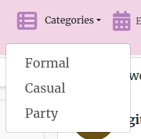

# Designer Hub

Designer Hub is a social media platform for designers. It's a platform where they interact and show their creativity. The platform is well structured and 
user friendly. 
The live website can be found [here](https://designerhubfrontend-3b76bba91fa8.herokuapp.com/)

# Table of Contents

1. [Project](#project)
2.

# Project

## User Goal

Users use this platform to express their creativity. They can always update their own ideas and get in touch with the ideas generated by others. 
User can have a great community based interaction with the people from same background. New contents and events are always visible on the top. By liking or commenting they can express their opinios. Designers will get to know what their fellow mates think about their designs. They can follow each other to get in touch with each other. This is a supportive environment. User will fell encouraged to post new designs.

# Project Development

## Wireframes

The wireframes have been created for both mobile and desktop view by [Balsamiq](https://balsamiq.com/). The major wireframes are drawn. Add post page and add event pages are very similar. Also home page and events Page are similar. So Add Post and Home Page wireframes are drawn.

  
Wireframe Home

  
Home Desktop

  
  
Home Mobile

  

  
Add Post

  
Add Post Desktop

  
  
Add Post Mobile

  

  
Profile

  
Profile Desktop

  
  
Profile Mobile

  

  
Sign Up

  
SignUp Desktop

  
  
SignUp Mobile

  

  
Sign In

  
SignIn Desktop

  
  
SignIn Mobile

  

## Agile Mthodology

The project is developed via agile method. Different user stories have been created and implemented on the project. The story details can be found 
[here](https://github.com/users/farhatamannaislam/projects/7/views/1)

The user stories are given below:

* As a user I can view a navbar from every page so that I can navigate easily between pages.
* As a user I can create a new account so that I can access all the features of signed up user.
* As a logged in user I can create post so that I can share it with everyone else on the platform.
* As a user I can view the details of a post so that I know more about it.
* As a user I can view all the recent posts so that I get up to date with the new contents.
* As a user I can search post with keywords so that I can find posts where I am interested.
* As a user I can keep scrolling through the posts so that I don't have to click on next page.
* As a user I can edit my own posts so that I can make corrections/update.
* As a user I can can read comments by other users under posts so that I can know their opinions.
* As a user I can see a list of most followed profiles so that I know which profiles are popular.
* As a user I can follow/unfollow other users so that I can see/un see posts from users which I want to.
* As a user I can get notified when I get like, comment, follow so that I get updated fast with my current scenario.
* As a user I can see or post events so that I know and update about upcoming incidents.

## Design Choices

* Color: Designer Hub is a provides a vibrant and approachable environment for users. I used vibrant pink logo with a baby pink nav bar color.
The main body is white so that posts are have more highlights. Buttons are bright purple with white text. 

* Typography: The main font of this site is Merriweather with a fallback of  Sans-Serif .

* Imagery: All the images used in this website are taken from [Pixabay](https://pixabay.com/images/search/free%20images/) . The logo is made from 
[FreeLogoDesign](https://www.freelogodesign.org/)

# Features

## Navigation

The navigation bar is visible on the top in desktop view. In mobile view it will come under a Hamburger Icon. A new user /logged out user can see
navbar with Logo, Home, Categories, Events, Sign In and Sign Up.

After siging in user can see navbar with Logo, Notifications bell icon, Home, Categories, Add Post, Add Event, Events, Feed, Profile and Sign Out.

## Home 

Logged In / Logged out all users can see Home. There are posts in the home page. Posts are shown with author name , creation date, title, content no of likes and no of comments. In desktop view on the right side of the posts Most followed profiles are visible. In mobile view four most followed profiles are visible on the top.

Above the posts there is search option. User can search posts by authorname, category, title, content.

## Category

Under the category three options are available Formal, Casual and Party. User can filter post by selecting the category.

## Events

Events has similar features as posts. Logged In /Logged out all users can see this. User can search events with title, profile, event date or tags. Authorname, creation date, title, content, event date and tag is visible for an event. On the right side of the posts Most followed profiles are visible.

## Sign Up

Sign Up page comes with the option of username, password, confirm password input fields and sign up button. It will also ask the user if he already has an account. Is so it will direct the user to a link with sign in. On the right side of the page there is a beautiful stylish photo of an woman.

## Sign In

Sign In page comes with username and passowrd input fields and sign in button. There is a picture of a stylish man on the right side of the page. The page will ask the user that if he doesn't have an account. If so it will redirect the user to Sign Up via link.

## Notifications

A logged in user can see the bell icon of notifications. Under this icon he will see all the notifications related to like, comment on his post or getting new follower. He can individually click a notification and read it. There is also an option Mark all as read. The no of unread notifications are showed beside the bell icon.

## Add Post

A logged in user has the option to add a post. In the add post page there is input fields for title, content, selecting category from formal, casual or party and uploading image. There is cancle and create button along with it.

## Add Event

A logged in user has the option to add an event. In the add event page there is input fields for title, description, event date, tags and uploading image. There is cancle and create button along with it.

## Feed

In the feed option user can see post and events by the users whom he follows.

## Profile

A logged in user can see his profile by clicking profile tab. The number of his posts, no of his followers and no of his following users are visible on the top beside his profile picture. His posts are visible under this Information. There is an option for the user to edit profile, change username and/or password. A profile will be automatically created when an user signs up. There is a default avatar that will be shown as user profile picture. User can change this avatar to his own profile picture.

## Edit/Delete Post and Event

User can edit/delete his own post and event.

If he clicks the post/event there will be option shown in the top right corner of the post and event to edit or delete it.

## Infinite Scroll

If there are many posts user can scroll through the posts. Infinite scroll is implemented here.

## Alter

If any mandatory field is missing the application will give altert. Such as user is not allowed to create post without title. And user can not create event
without Title, Date and Tag.

# Technologies Used

* HTML5
* CSS
* JavaScript
* React.js

# Frameworks and tools

* Heroku - for deployment.
* React Bootstrap - for building solid, responsive, mobile-first sites.
* Balsamiq - to create wireframes.
* Am I responsive? - to check website responsiveness.
* Lighthouse - for site performance.
* Colormind - for generating color palette
* Chrome Dev Tool - to debug and check responsiveness.
* Github - to host the repository, store the commit history and manage the project board containing user stories.
* Cloudinary - hosting image files of the project.
* W3C HTML Validator- to validate HTML.
* W3C CSS Validator - to validate CSS.
* JSHint Validator - to Validate Javascript.

