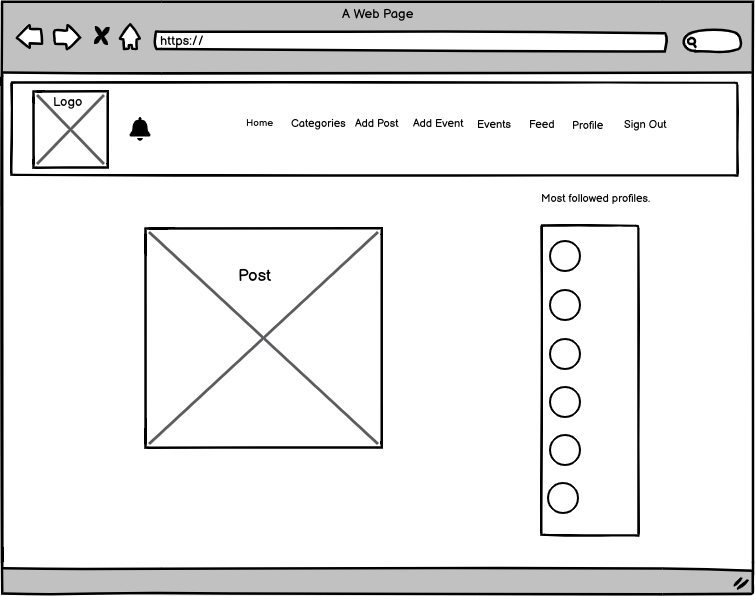
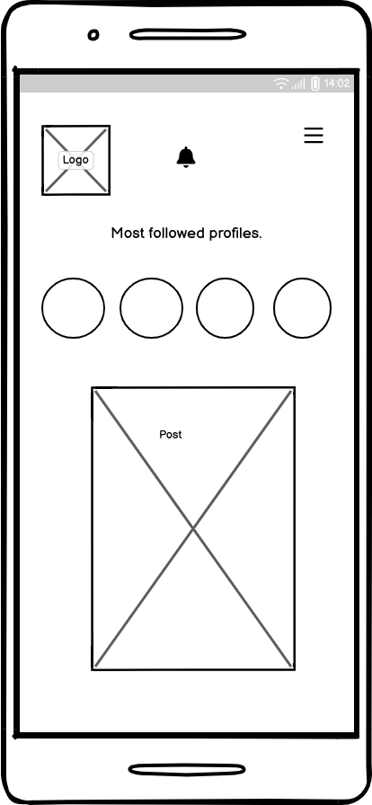

# Designer Hub

Designer Hub is a social media platform for designers. It's a platform where they interact and show their creativity. The platform is well structured and 
user friendly. 
The live website can be found [here](https://designerhubfrontend-3b76bba91fa8.herokuapp.com/)

# Table of Contents

1. [Project](#project)
2.

# Project

## User Goal

Users use this platform to express their creativity. They can always update their own ideas and get in touch with the ideas generated by others. 
User can have a great community based interaction with the people from same background. New contents and events are always visible on the top. By liking or commenting they can express their opinios. Designers will get to know what their fellow mates think about their designs. They can follow each other to get in touch with each other. This is a supportive environment. User will fell encouraged to post new designs.

# Project Development

## Wireframes

The wireframes have been created for both mobile and desktop view by [Balsamiq](https://balsamiq.com/). The major wireframes are drawn. Add post page and add event pages are very similar. Also home page and events Page are similar. So Add Post and Home Page wireframes are drawn.

  
Wireframe Home

  
Home Desktop

  
  
Home Mobile

  

  
Add Post

  
Add Post Desktop

  
  
Add Post Mobile

  

  
Profile

  
Profile Desktop

  
  
Profile Mobile

  

  
Sign Up

  
SignUp Desktop

  
  
SignUp Mobile

  

  
Sign In

  
SignIn Desktop

  
  
SignIn Mobile

  

## Agile Mthodology

The project is developed via agile method. Different user stories have been created and implemented on the project. The story details can be found 
[here](https://github.com/users/farhatamannaislam/projects/7/views/1)

The user stories are given below:

* As a user I can view a navbar from every page so that I can navigate easily between pages.
* As a user I can create a new account so that I can access all the features of signed up user.
* As a logged in user I can create post so that I can share it with everyone else on the platform.
* As a user I can view the details of a post so that I know more about it.
* As a user I can view all the recent posts so that I get up to date with the new contents.
* As a user I can search post with keywords so that I can find posts where I am interested.
* As a user I can keep scrolling through the posts so that I don't have to click on next page.
* As a user I can edit my own posts so that I can make corrections/update.
* As a user I can can read comments by other users under posts so that I can know their opinions.
* As a user I can see a list of most followed profiles so that I know which profiles are popular.
* As a user I can follow/unfollow other users so that I can see/un see posts from users which I want to.
* As a user I can get notified when I get like, comment, follow so that I get updated fast with my current scenario.
* As a user I can see or post events so that I know and update about upcoming incidents.

## Design Choices

* Color: Designer Hub is a provides a vibrant and approachable environment for users. I used vibrant pink logo with a baby pink nav bar color.
The main body is white so that posts are have more highlights. Buttons are bright purple with white text. 

* Typography: The main font of this site is Merriweather with a fallback of  Sans-Serif .

* Imagery: All the images used in this website are taken from [Pixabay](https://pixabay.com/images/search/free%20images/)

