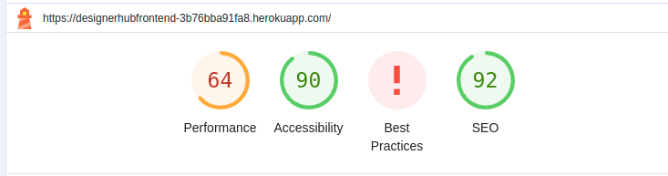
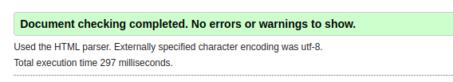
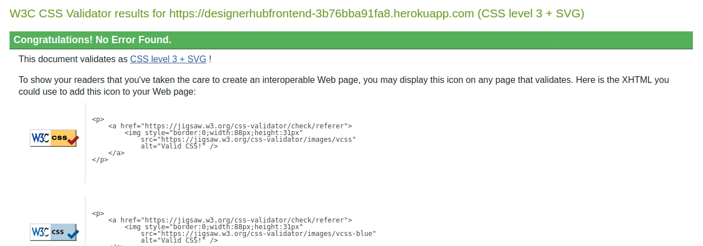

# Automated Testing

The given automated jest have been written to check that frontent components work correctly:

* MoreDropdown.test.js

Renders the dropdown button correctly.

* Avatar.test.js

Renders the avatar correctly.

* NavBar.js

Renders the NavBar.
Renders link to the user profile for a logged in user.
Renders Sign in and Sign up buttons again on log out.

# Manual Testing

The given manual tests are performed to check the functionality of the aplication.

## Authentication - Logged Out User

1. Mobile users can't see an image next to the sign in form.
2. Mobile users can't see an image next to the sign up form.
3. Desktop and tablet users can see an image next to the sign in form.
4. Desktop and tablet users can see an image next to the sign up form.
5. Typing https://designerhubfrontend-3b76bba91fa8.herokuapp.com/posts/create will redirect to HomePage.
6. Typing https://designerhubfrontend-3b76bba91fa8.herokuapp.com/events/create will redirect to HomePage.
7. Typing https://designerhubfrontend-3b76bba91fa8.herokuapp.com/eventspage will redirect to EventsPage.
8. Typing https://designerhubfrontend-3b76bba91fa8.herokuapp.com/eventsfeed will redirect to EventsPage.
9. Typing https://designerhubfrontend-3b76bba91fa8.herokuapp.com/postsfeed will redirect to HomePage.

## Navigation - Logged In User

1. User can not see the sign in button in the navigation bar profile section dropdown menu.
2. User can see the profile page link in the navigation bar.
3. User can see the sign out link in the navigation bar.
4. User can see the Notification bell icon link in the navigation bar.
5. User can see the 'Add Post' button in the navigation bar.
6. User can see the 'Add Event' button in the navigation bar.
7. User can see the Feed menu option in the navigation bar.
8. Users can see the Categories menu option in the navigation bar.
9. Tablet and mobile users can see the navigation bar options in a burger menu dropdown.

## Homepage - Logged Out User

1. User can view the Most followed profiles component.
2. User can not view the follow button under each Popular Profile.
3. Clicking on a popular profile image/avatar, users are redirected to the selected profile page.
4. User can view all posts - content, title, image, no of likes, no of comments.
5. If user click on like count they will get the message 'Log in to like posts!'
6. User can search a post by typing in the title, content, category , authorname.
7. Users can filter the list of posts by selecting a category from the category dropdown.

## Eventpage - Logged Out User

1. User can search an event by typing in the title, content, event date , tag.
2. User can view all events - content, title, image, date, tag.
3. Clicking on a popular profile image/avatar, users are redirected to the selected profile page.
4. User can view the Most followed profiles component.
5. User can search an event by typing  title, content, event date , tag.

## Homepage - Logged In User

1. Users can view the Popular Profiles component.
2. Users can view the follow button beside each Popular Profile.
3. Clicking on a popular profile image, user is redirected to the selected profile page.
4. User can view all posts - content, title, image, no of likes, no of comments.
5. If the logged in user is the post owner, user can not click the like button.
6. If the logged in user is the post owner, user can click the like button.
7. User can see the comments of a post and create new comments.
8. Users can filter the list of posts by selecting a category from the category dropdown.

## Eventpage - Logged In User

1. Users can view the Popular Profiles component.
2. Users can view the follow button beside each Popular Profile.
3. Clicking on a popular profile image, user is redirected to the selected profile page.
4. User can view all events - content, title, image, date, tag.
5. Clicking on an event image, users are redirected to the selected event detail page.
6. User can search an event by typing  title, content, event date , tag.

## Add Post Page

1. User can view the empty form to create a new post.
2. User can create a post with title, content, image and category.
3. User can not create a post without title. Title is mandatory.
4. User has to upload an image for the first time.
5. If user doesn't select any category 'Formal' category is automatically selected. This is the default category.

## Add Event Page

1. User has to create event with title, content, day and tag. If any of these is missing user will get warning. 
2. User also has to upload image for the event.

## Notification

1. Logged in user can see notification bell icon.
2. User can see his notifications if he clicks the bell icon.
3. Notifications are if another user likes, comments his post or fllow him.
4. The no of notification cound is shown in red beside the bell icon.

## Feed

1. User can choose Posts or Events from Feed dropdown menu selection.
2. If user clicks Posts he can see all posts posted by profiles they follow.
3. If user clicks Events he can see all events posted by profiles they follow.
4. Feed Post page has the similar functionality as Home Page.
5. Feed Event page has the similar functionality as Event Page.

## Profile Page

1. User is the Profile owner here.
2. User can view the number of posts the profile owner has posted.
3. User can view the number of followers the selected profile has.
4. User can view the number of other profiles the selected profile is following.
5. User has the option to edit Profile, change username and change password by clicking top right corner 3 dots of the profile information.

## Edit Profile Page
1. User can change Profile picture or bio in the edit profile page.

## EditPost

1. If the logged in user is the owner of the post, they can see the three dots edit/delete menu next to the created at date.
2. By clicking edit post, user is redirected to edit post page.
3. User can delete his own post via the three dots edit/delete menu.
4. By clicking delete post, user is taken to create post page. 

## Delete Post

1. If the logged in user is the owner of the event, they can see the three dots edit/delete menu next to the created at date.
2. By clicking edit event, user is redirected to edit event page.
3. User can delete his own event via the three dots edit/delete menu.
4. By clicking delete event, user is taken to create event page. 

# Browser Compatibility

The application is tested with Google Chrome, Microsoft Edge and Safari. Appearance and functionality appears to be similar and consistent.

# Lighthouse Testing

# Known Bugs
There is no known bug in the application.

# Validator Testing

No error found on [W3C HTML Validator](https://validator.w3.org/)

 

No error found on [W3C CSS Validator](https://jigsaw.w3.org/css-validator/)

